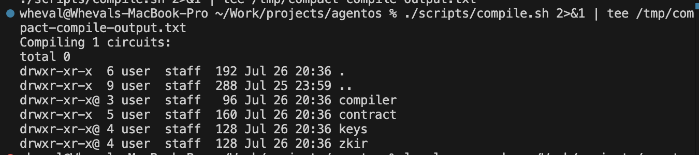
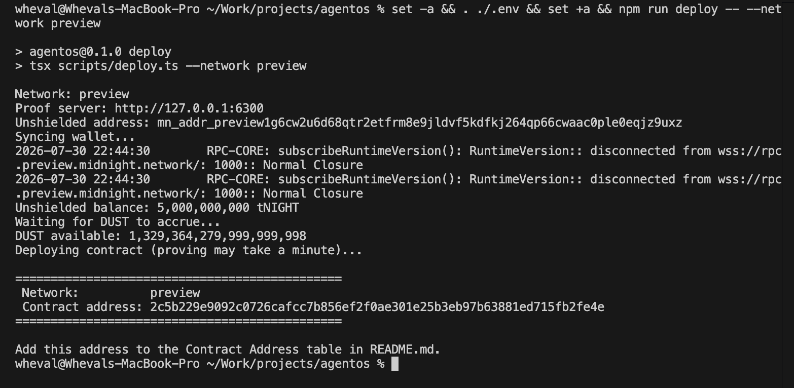
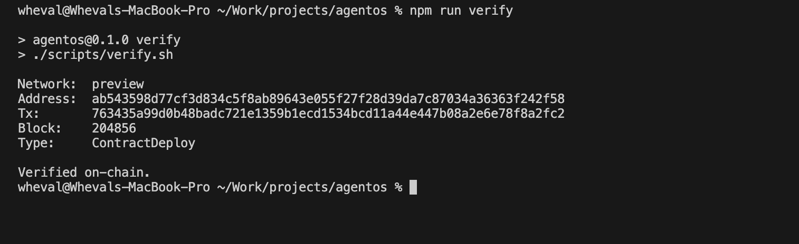

# AgentOS — PrivateCounter

> A counter whose step size is chosen privately and proved to sit inside an on-chain policy bound, without the step ever being published.

## Contract Address

| Network | Address |
| ------- | ------- |
| Preview | `ab543598d77cf3d834c5f8ab89643e055f27f28d39da7c87034a36363f242f58` |
| Preprod | _not deployed_ |

Deployed in block 204856, transaction `763435a99d0b48badc721e1359b1ecd1534bcd11a44e447b08a2e6e78f8a2fc2`.

## What This Does

`PrivateCounter` is a shared counter with a rule attached: every increment must be at
least 1 and at most `max_step`.

The twist is where the step size lives. It is never sent to the network as a circuit
argument. It stays on the caller's own machine as a witness, and the zero-knowledge proof
is what convinces the chain that the rule was followed. Observers watching the ledger see
the counter move and the running total change — they never see which step any individual
caller chose.

That is the pattern AgentOS is built around: an autonomous agent acts under a policy, the
policy is enforced cryptographically rather than by trust, and the agent's inputs stay
private while the outcome stays auditable.

## Privacy Model

**PUBLIC — written to the ledger, readable by anyone**

| Field | Meaning |
| ----- | ------- |
| `round` | How many times `increment()` has been accepted |
| `total` | Running total of every accepted step |
| `max_step` | Largest step the contract accepts (write-once, set at deploy) |

**PRIVATE — a witness supplied by the caller's machine**

- `secret_step()` — the step size. It is not a circuit argument, it is not stored on the
  ledger, and it is not in the transaction. Only the proof sees it.

**PROVED WITHOUT REVEALING THE STEP**

- `1 <= secret_step() <= max_step`

**Where `disclose()` comes in**

The contract writes two ledger fields, and only one of them needs `disclose()`:

```compact
round = (round + 1) as Uint<64>;              // derived from public state only
total = disclose((total + step) as Uint<64>); // derived from the private witness
```

`round` counts public events, so the compiler accepts it as-is. `total` is computed from
the witness, so the compiler refuses to write it until it is wrapped in `disclose()`. That
single call is the deliberate, auditable point where private data is allowed to move the
public state. Removing it is a compile error, not a silent leak — which is the point.

Note that `total` leaks strictly less than the step itself. After N rounds an observer
knows the sum, not the individual contributions.

## Tech Stack

- **Midnight Network** — Preview / Preprod testnets
- **Compact** — language version 0.23, compiler 0.31.1, runtime 0.16.0
- **Midnight.js** — `@midnight-ntwrk/midnight-js` 4.1.x for deployment
- **Node.js** v22+
- **Docker** — runs the local proof server
- **Vitest** — contract test suite

## Prerequisites

| Requirement | Notes |
| ----------- | ----- |
| Node.js v22+ | `node --version` |
| Docker | Must be running; hosts the proof server |
| Compact toolchain | Installed via the Midnight `compact` version manager, **not** npm |
| Proof server | `midnightntwrk/proof-server` on port 6300 |
| Funded testnet wallet | Only needed to deploy, not to build or test |

Install the Compact toolchain:

```bash
curl --proto '=https' --tlsv1.2 -LsSf \
  https://github.com/midnightntwrk/compact/releases/latest/download/compact-installer.sh | sh
compact update
compact --version
```

Start the proof server:

```bash
docker pull midnightntwrk/proof-server:latest
docker run -d --name midnight-proof-server -p 6300:6300 \
  midnightntwrk/proof-server:latest midnight-proof-server -v
```

## Setup

```bash
git clone https://github.com/wheval/agentos.git
cd agentos
npm install
npm run compile
```

`npm run compile` runs `compact compile contracts/counter.compact managed`, which
regenerates `managed/` from scratch:

```
managed/
├── compiler/contract-info.json   circuit + witness + ledger metadata
├── contract/index.js, index.d.ts TypeScript bindings
├── keys/increment.prover         proving key
├── keys/increment.verifier       verifying key
└── zkir/increment.zkir           circuit intermediate representation
```

`managed/` is committed to this repo so the compiled artifacts can be reviewed without
installing the toolchain.

## Run Tests

```bash
npm test              # contract test suite (Vitest)
npm run test:artifacts # committed artifacts match the contract source
npm run typecheck     # TypeScript
```

`npm test` runs five tests against the compiled circuit through the Compact simulator:

| Test | Covers |
| ---- | ------ |
| Initialises public ledger state from the constructor | Initial state |
| Advances public state by the private step on each increment | Circuit logic + state transitions |
| Rejects steps outside the publicly declared policy bound | Policy enforcement |
| Never writes the private step into the public ledger | Privacy guarantee |
| Produces identical public state for different private step sequences | Privacy guarantee |

## Deploy

```bash
export MIDNIGHT_SEED=<64-character hex seed>
npm run deploy -- --network preview   # or --network preprod
```

The script derives the wallet, prints the unshielded address, waits for faucet funds,
registers NIGHT UTXOs for DUST generation, then deploys and prints the contract address.

Faucets: [Preview](https://faucet.preview.midnight.network/) ·
[Preprod](https://faucet.preprod.midnight.network/)

## Verify the Deployment

You do not have to take the address in this README on trust. Read it back from the
Midnight indexer yourself:

```bash
npm run verify
```

```
Network:  preview
Address:  ab543598d77cf3d834c5f8ab89643e055f27f28d39da7c87034a36363f242f58
Tx:       763435a99d0b48badc721e1359b1ecd1534bcd11a44e447b08a2e6e78f8a2fc2
Block:    204856
Type:     ContractDeploy

Verified on-chain.
```

## Project Structure

```
agentos/
├── contracts/counter.compact   the Compact contract
├── managed/                    compiler output (committed)
├── scripts/compile.sh          compile wrapper
├── scripts/deploy.ts           testnet deployment
├── scripts/verify.sh           reads the deployment back from the indexer
├── src/                        frontend (Level 2)
├── tests/counter.test.ts       contract test suite
├── .github/workflows/ci.yml    CI
└── README.md
```

## Initial Idea

**AgentOS — the control center for enterprise AI teams.**

Companies want AI agents doing real work: paying invoices, reviewing code, managing
operations. What stops them is trust. Nobody wants to hand an autonomous agent their API
keys, customer data, bank access, or production systems and simply hope it behaves.

AgentOS gives every agent an identity, scoped permissions, private memory, secure secrets,
and a manager. Think of it as an ID badge and a job description for each AI employee:

- **Finance Agent** — pays invoices, reads email, generates reports. Cannot move more than $5k.
- **Developer Agent** — opens PRs, reviews code, deploys staging. Cannot touch production.
- **HR Agent** — handles leave and contracts. Cannot see engineering or finance.
- **Operations Agent** — runs Slack, Notion, Linear. Cannot reach sensitive data.

Agents collaborate. "Hire a developer" fans out: HR drafts the contract, Finance checks
budget, Legal reviews, Operations provisions tools. Every step is checked against policy
before it runs.

**Why this needs Midnight.** Policy enforcement is only worth something if the policy
itself can't be quietly rewritten, and if checking it doesn't require handing over the very
secrets you're protecting. Midnight gives us both: the policy bound lives on-chain where
tampering is visible, and the agent proves compliance in zero knowledge instead of
disclosing its inputs. The audit trail is cryptographic, not a log file somebody can edit.

**Where this Level 1 contract fits.** `PrivateCounter` is the smallest honest version of
that mechanism. `max_step` is a policy bound published on-chain. `secret_step` is an
agent's private input that never leaves its machine. `increment()` is the agent acting: it
proves `1 <= step <= max_step` without revealing `step`, and the single `disclose()` call
marks the exact, auditable point where private data is permitted to affect public state.

Swap the counter for a payment and `max_step` for a spending limit and you have the Finance
Agent: an agent that can prove it stayed under budget without publishing what it spent.
That is the primitive the rest of AgentOS is built on.

## Screenshots

### Compile output

`npm run compile` producing the `managed/` artifacts:



### Deployed contract address

`npm run deploy -- --network preview` returning the Preview address:



### On-chain verification

The deployment read back from the Midnight Preview indexer:


